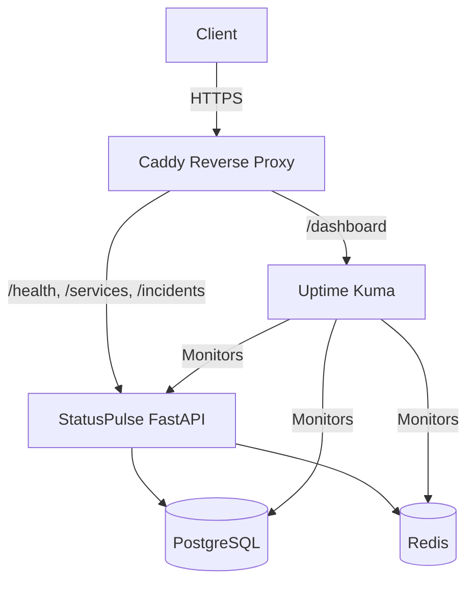

# StatusPulse

StatusPulse is a lightweight status page and health monitoring API. This repository contains the complete production-ready infrastructure to deploy the application, including containerization, CI/CD, HTTPS reverse proxy, monitoring, alerting, IaC (Terraform), and security hardening.

## Architecture



## Prerequisites

- **Docker** & **Docker Compose**
- **GNU Make** (optional, for convenience)
- **Terraform** (for cloud infrastructure provisioning)
- A registered domain or sub-domain (e.g., DuckDNS) pointing to your deployment server

## How to Run Locally

We provide a `docker-compose.yml` for running the stack locally in development.

1. **Setup Environment Variables**:
   ```bash
   cp .env.example .env
   ```
2. **Start the Stack**:
   Use the provided `Makefile` to build and start the containers.
   ```bash
   make build
   make up
   ```
3. **Verify Health**:
   The application will be accessible at `http://localhost:8000`. You can test it via:
   ```bash
   make test
   ```
4. **Tear Down**:
   ```bash
   make down
   ```

## How to Deploy to Production

Production deployment is fully automated using GitHub Actions and Terraform.

1. **Provision Infrastructure**:
   Navigate to the `terraform/` directory. Initialize and apply the configuration to spin up the cloud VM.
   ```bash
   cd terraform
   terraform init
   terraform apply
   ```
   *Note: This provisions a server and configures the initial firewall rules, non-root user, and dependencies.*

2. **Configure Secrets**:
   Set your deployment secrets in your GitHub Repository Settings (e.g., `REGISTRY`, server credentials for SSH, etc.).

3. **Deploy**:
   Deployment is handled by the CI/CD pipeline. Pushing to the `main` branch will automatically trigger a build, run tests, and execute `scripts/deploy.sh` on the server to achieve a zero-downtime deployment.

## CI/CD Pipeline

The CI/CD workflow is defined in `.github/workflows/`.

- **CI (`ci.yml`)**: Triggered on pushes and PRs to `main`. It lints Python code (Ruff) and the Dockerfile (Hadolint). It builds the image, starts the full stack in the runner, and runs integration tests (`tests/test_integration.sh`).
- **CD (`deploy.yml`)**: Triggered on push to `main` after CI passes. It tags the image, pushes it to `ghcr.io`, SSHs into the server, and triggers the `deploy.sh` script. A health check ensures that if the new deployment is unhealthy, it will automatically rollback to the previous image.

## Monitoring & Alerting

- **Uptime Kuma**: Deployed as part of the production compose stack and routed via Caddy. It continuously monitors the `/health` endpoint, PostgreSQL, Redis, and TLS certificate expiry.
- **Health Monitor Script**: A cron job runs `scripts/health-monitor.sh` every 5 minutes on the server. It monitors disk usage (>80%), memory (>90%), Docker container health, and API endpoints, firing alerts to Webhook channels (Discord/Slack/etc.) if any anomalies are detected.

## Backup and Restore

Database backups are handled automatically by a cron job running `scripts/backup.sh`.
- **Backup**: Dumps PostgreSQL data into compressed `.sql.gz` files stored in `/home/deploy/backups` daily. Old backups are rotated, keeping only the last 7 days.
- **Restore**: To restore from a backup, use the following commands:
  ```bash
  gzip -d statuspulse_db_YYYY-MM-DD_HHMMSS.sql.gz
  docker exec -i statuspulse-db-1 psql -U postgres statuspulse < statuspulse_db_YYYY-MM-DD_HHMMSS.sql
  ```

## Security Hardening

For details on security scans, fixes, secret management, and header hardening, please refer to [SECURITY.md](SECURITY.md).

## Troubleshooting

- **Containers failing to start**: Check the logs using `make logs` or `docker compose logs -f`.
- **Database Connection Issues**: Ensure `.env` is correctly populated and mounted in the `docker-compose.yml`.
- **Deployment Rollbacks**: If a deployment instantly rolls back, check the GitHub Actions logs. The `deploy.sh` script will fail if `/health` returns anything other than `200 OK` during the verification step.
- **TLS Issues**: If Caddy fails to provision a certificate, ensure port 80 and 443 are open in the server firewall (UFW) and the DNS record points to the correct server IP.
